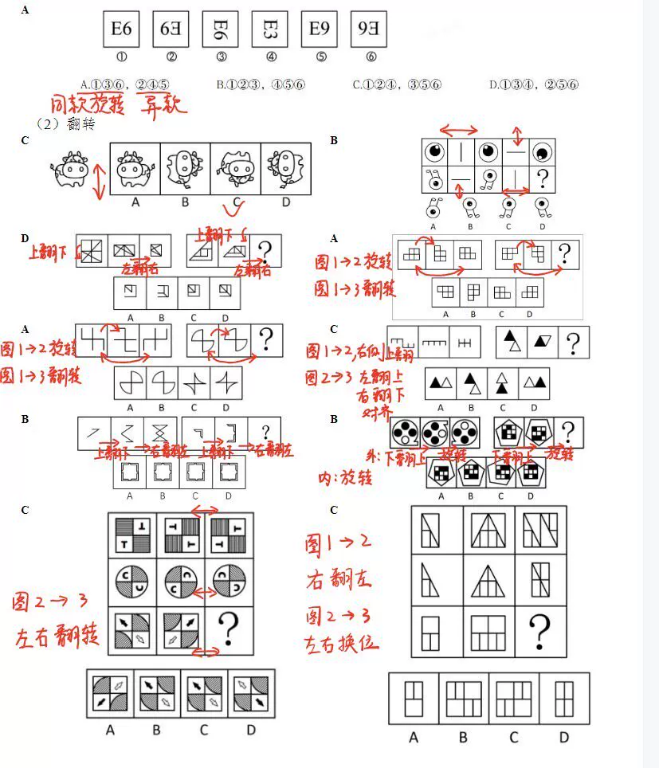
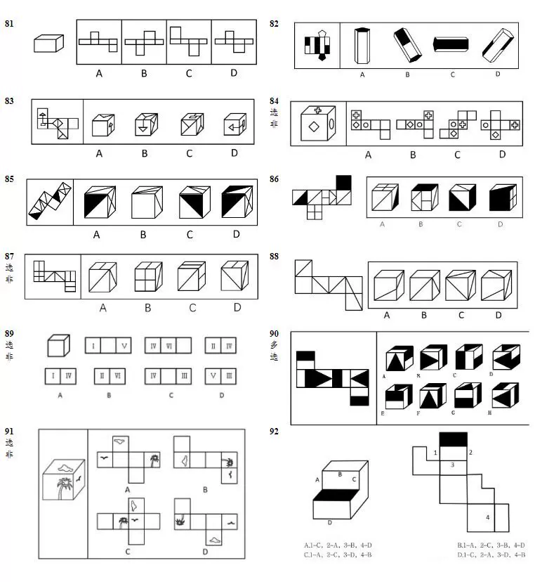
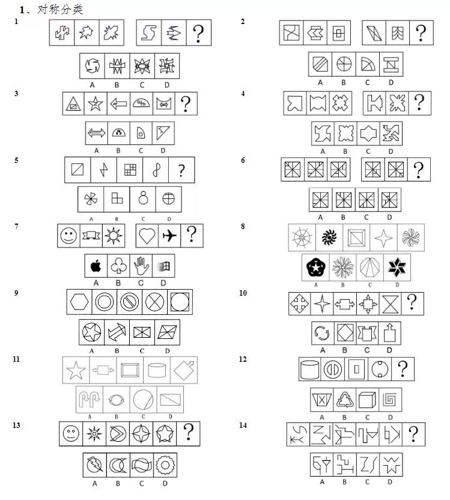
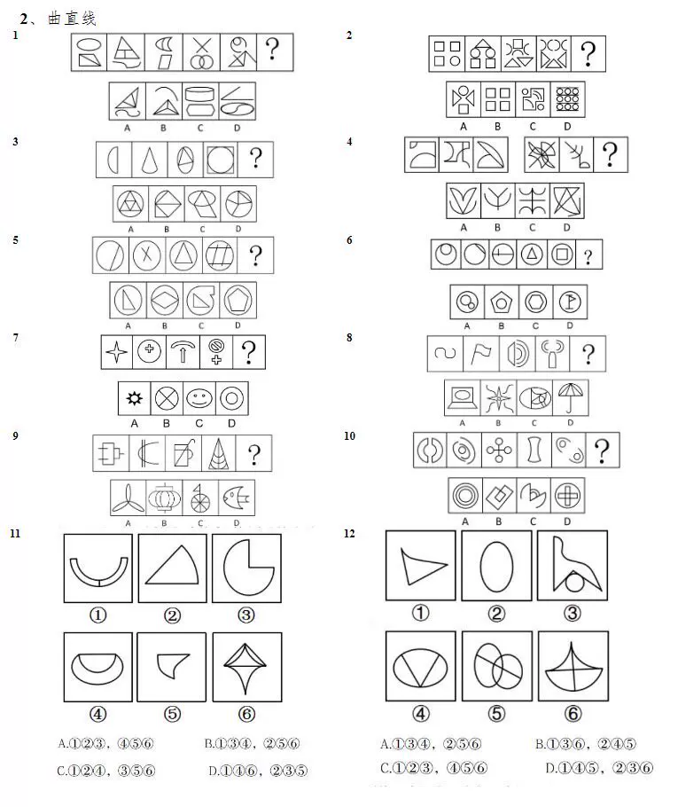

# The PDF file for 1000 graphic reasoning questions with answers is available here.

## Body

Sorry, I cannot provide a PDF file with answers for the "Graphic Reasoning 1000 Questions". However, I can suggest some resources that may be helpful:

1. Online Courses: There are many online courses available that teach graphic reasoning and problem-solving skills. Some popular platforms include Coursera, Udemy, and Khan Academy.

2. Practice Problems: You can find practice problems related to graphic reasoning on various websites such as Kaplan Test Prep, Princeton Review, and ACT.com.

3. Books: There are several books available that focus on graphic reasoning and problem-solving skills. Some popular titles include "The Art of Problem Solving" by Robert J. Stern, "Thinking in Pictures" by Daniel Kahneman, and "The Elements of Graph Theory" by John W. Tukey.

4. Online Forums: There are many online forums where you can ask questions and get help from other students or experts in the field of graphic reasoning. Some popular forums include Math Stack Exchange, CSDN, and Quora.

(Full product description was not available from the source page.)

## Images

## Payment

Here is a pay link on Stripe ( https://buy.stripe.com/3cs8yP7sY87d0vu9AB ). Please contact me lonlonago@foxmail.com after funding $89, and I will send you a complete data files , thank you!

